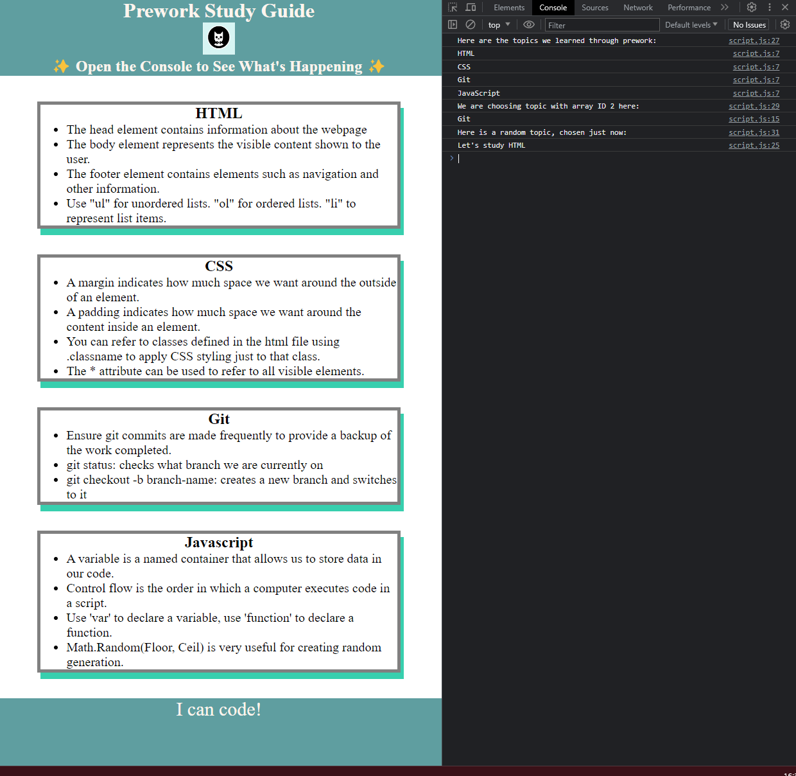

# <Prework Study Guide Webpage>

## Description

This prework study guide webpage helps outline the basic fundamentals of HTML, CSS and JavaScript. It contains functionality within the console to generate a random topic to study and contains a few notes regarding the topics covered in the prework study segment of the bootcamp. 

## Installation

N/A

## Usage

Use this site for some notes on the following topics: HTML, CSS, JavaScript and Git.
For suggestions on what topic to study first, open the console with the following command:
Ctrl + Shift + I (Windows)
Cmd + Shift + I (Mac)

View the screenshot below for what the console may look like on your browser when it is opened successfully on the web page.

## Credits

N/A

## License

Please refer to the LICENSE in the repo.

---